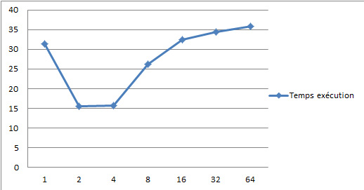

# TD/TP1 : Ensemble de Mandelbrot

## Calcul séquentiel

### Question 1 

Dans le code deux boucles for imbriquées permettent de parcourir l'ensemble des pixels de l'images et d'en calculer la valeur
  j va de 0 à W-1 (largueur image)
  i va de 0 à H-1 (hauteur image) 

Utilisation pour les pixels d'unsigned char codés sur 8 bits

Puisque l'ensemble est discret alors que le plan complexe est continu, nous calculons l’incrément xinc, yinc entre les coordonnées de pixels contigus

  * x(i) = xmin + xinc * i
  * y(j) = ymin + yinc * j

Avec :

  * xinc = (xmax - xmin) / (w - 1)
  * yinc = (ymax - ymin) / (h - 1)

### Question 2

#### 2.1
```
gcc -o mandel mandel.c -lm  
./mandel  
Temps total de calcul : 5.49344 sec
```


#### 2.2 && 2.3
```
./mandel 800 800 0.35 0.355 0.353 0.358 200  
Temps total de calcul : 0.449191 sec
```


Commentaires : changement du domaine a calculer dans le plan complexe. On remarque un déplacement de la zone de calcul

```
./mandel 800 800 -0.736 -0.184 -0.735 -0.183 500  
Temps total de calcul : 1.48156 sec
```


Commentaires : changement du domaine a calculer dans le plan complexe et profondeur


```
./mandel 800 800 -0.736 -0.184 -0.735 -0.183 300  
Temps total de calcul : 1.24605 sec
```


Commentaires : changement de profondeur (nombre maximale d’itération) par rapport à l'image précédente, on remarque un nombre de formes plus important.

## Calcul parallèle

### Statique

#### Question 3

##### 3.1

La fonction xy2color() dans le code, nécessite de connaître la position en 2D (en x et en y) du pixel précédent. Cette fonction ne peut pas être parallélisable, c'est cela qui rend difficile la parallélisation.

Le calcul aux différentes profondeurs (fonction xy2color()) n'est pas parallélisable, puisque la valeur d'un pixel à la profondeur n+1 est une fonction complexe de la valeur de ce pixel à la profondeur n (la valeur à la profondeur n+1 écrase en mémoire celle à la profondeur n). 

En revanche, chaque pixel de l'image subit le même traitement (les deux boucles for imbirquées) qui ne dépend pas de la valeur d'autres pixels => partie parallélisable.

##### 3.2

* Découpage de l'image
* Le maître alloue les sous-parties de l'image aux ouvriers
* Chaque ouvrier traite sa partie puis l'envoie au maître qui ré-assemble le tout (le maître aussi traite une partie de l'image)

##### 3.3

h_loc = H/P
P = nombre de processeur

Ymin_loc(rank) = Ymin + h_loc*rank*Yinc

Allocation mémoire :

  * Maître : h ∗ w ∗ sizeof(char)
  * Ouvrier : h_loc ∗ w ∗ sizeof(char)

###### Algo 1 

Données :
  H : hauteur totale de l'image  
  W : longueur totale de l'image  
  rank : rang du processeur  
  h_local : hauteur d'un bloc  

```
Si rank == MAITRE alors
	Allocation dynamique mémoire de l'image globale  
	Test de l'allocation dynamique  
	Traitement d'un bloc point par point  
	Recomposition de l'image à partir des différentes parties  
Sinon  
	Allocation mémoire locale  
	Traitement d'un bloc point par point  
	Envoie au maître du bloc traité  
```

Recomposition de l'image à partir des différentes parties 

```
Si rank == MAITRE alors
  Réception des blocs traités par les ouvriers
  Ajout à l'image globale de ces parties
  Affichage du chronomètre
  Sauvegarde de l'image
```

##### 3.4

Voir code joint [mandel_statique.c](src/mandel_statique.c)
```
mpicc -o mandel_statique mandel_statique.c -lm -std=c99
```

#### Analyse des performances

##### Question 4

###### 4.1 & 4.2

Tests effectués en faisant varier le nombre de processus à l'aide commande suivante sur pi configuré comme expliqué dans [configuration pi](config_pi.md)

```
mpiexec -n 4 ./mandel_statique
```

###### 4.3 & 4.4

Tests réalisés sur 4 Raspberry Pi  2 Pi2  et 2 Pi3  



Cette courbe nous montre qu'en méthode statique lorsque l'on augmente le nombre de processus dans un premier temps le temps d'exécution s'améliore mais qu'à partir de 8 processus tournant en parallèle le temps d'exécution globale recommence à augmenter. Pour comprendre ce phénomène regardons les courbes d'évolution du temps d’exécution pour les différents processus

* Pour n=2 processus


Pour deux processus on remarque que la charge de travail est la même pour les deux processus, nous pouvons nous y attendre il traite chacun la moitié de l'image présentant les même difficultés de traitement

* Pour n=8 processus


On remarque sur cette courbe que les processus qui s'occupent du milieu de l’image mettent plus de temps que ceux s'occupant des bords de l'image.

*Pour n=32 processus


On confirme ici que le centre de l'image est plus long a traité que les extrémités de l'image.

En statique comme nous attendons que chaque processus est finie de traités sa partie de l'image, le temps d’exécution raugmente lorsque l'on augmente le nombre de processus

Voir le tableur ods en annexe 1 pour plus de détails

### Dynamique

##### 3.2

* Répartition du travail restant entre les différents ouvriers
* Le maître répartit le travail au sein des ouvriers (il n'effectue aucun calcul)
* Le maître reçoit les blocs traités par les ouvriers, si besoin il leur envoie un nouveau bloc à traiter
* Le nombre de blocs est un argument du programme caractérisé par le nombre de lignes à traiter
* A chaque fois qu'un ouvrier finit de traiter un bloc, il l'envoie au maître qui le met au bon endroit

##### 3.3

Algo maître

```
Allocation dynamique de l'image globale
Test de l'allocation dynamique
Pour i de 0 à nb_proc faire
  Si i != rank_maitre
    // On envoie au esclave de rang i num_bloc

    // On incrémente num_bloc

  Pour i de 0 à h/nb_lignes faire
    // On reçoit le numéro de bloc traité par l'ouvrier
    // On détermine le rang de l'émetteur
    // On reçoit le bloc traité
    // Test fin de calcul de l'image
      // S'il reste des calcul à faire on envoie un numéro de bloc à calculer à l'ouvrier qui vient de finir son calcul
      // Sinon on envoie un message indiquant la fin du travail
```

##### 3.4

Voir code joint [mandel_dynamique.c](src/mandel_dynamique.c)
```
mpicc -o mandel_dynamique mandel_dynamique.c -lm -std=c99
```

#### Analyse des performances

##### Question 4

###### 4.1

Tests effectués en faisant varier le nombre de processus à l'aide commande suivante sur pi configuré comme expliqué dans [configuration pi](config_pi.md)

```
mpiexec -n 4 ./mandel_dynamique
```

###### 4.3 & 4.4

Tests réalisés sur 4 Raspberry Pi  2 Pi2  et 2 Pi3 


On remarque que pour deux processeurs le temps d’exécution est semblable à celui sans parallélisation en effet en dynamique le master ne travail pas donc lorsque deux processeurs tourne il n'y en a qu'un qui travail. On remarque que jusqu'à 16 processeurs il y a une amélioration puis que le temps raugmente à partir de 32 secondes.

* Pour n=4 processus


On remarque une amélioration du temps de traitement 

* Pour n=8 processus


On remarque une amélioration que la répartition de parties dynamiquement est efficace

* Pour n=32 processus


On y vois la limite, lorsque l'iamge est découpé en trop de petite parties la communication pour redistribuer les blocs non traités fait perdre trop de temps


Voir le tableur ods en annexe 1 pour plus de détails

### Comparaison statique et dynamique

##### 4.5


Dans notre cas le centre de l'image était plus longue à traiter que les extrémités de l'image. Il est donc normal que la répartition dynamique soit plus efficace que la répartition statique.

## Amélioration

### 5.1

* Réduire le temps non-actif des ouvriers (entre l'envoie la réception des données et la vérification qu'il n'y a pas de travail qu'il reste)