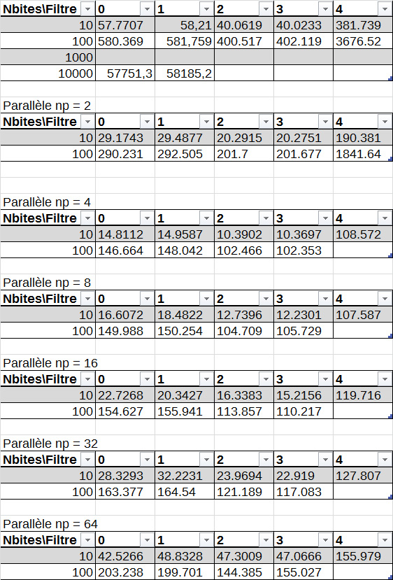

# TD/TP2 : Convolution

## Test code

```
gcc -o convol convol.c -lm
```

TODO insérer imade départ et résultat

Test sur ordinateur

```
./convol femme10.ras 0 100
Temps total de calcul : 0.2132 seconde(s) 

./convol femme10.ras 0 1000
Temps total de calcul : 2.11188 seconde(s) 

./convol femme10.ras 1 100
Temps total de calcul : 0.209322 seconde(s) 

./convol femme10.ras 1 1000
Temps total de calcul : 2.12449 seconde(s) 

./convol femme10.ras 2 100
Temps total de calcul : 0.185408 seconde(s) 

./convol femme10.ras 3 100
Temps total de calcul : 0.178958 seconde(s) 

./convol femme10.ras 4 100
Temps total de calcul : 2.37874 seconde(s) 
```

```
./convol Sukhothai_4080x6132.ras 0 100
Temps total de calcul : 83.2444 seconde(s)

./convol Sukhothai_4080x6132.ras 2 100
Temps total de calcul : 72.2662 seconde(s) 

./convol Sukhothai_4080x6132.ras 4 100
Temps total de calcul : 778.2 seconde(s) 
```

## Question 1

Dans la fonction convolution(), on prépare un tampon intermédiaire pour ne pas avoir à modifier l'image originale, car nous avons besoin des 9 pixels les plus proche d'un pixel pour effectuer le calcul, or si nous modifons directement les pixels d'une ligne par exmple, pour la ligne suivante 3 des pixels les plus proches auront une valeur déjjà transformé, ce qui ne nous permet pas d'effectuer le calcul de conolution correct.

## Question 2

La fonction convolution() qui dépend uniquement du x,y du pixel peut être paralléliser, cependant l'enchaînement des convolutions elle ne pas l'être, car pour effectuer la convolution n, nous avons besoin de l'ensemble de l'image qui a subit la convolution n-1.

## Question 3

9 multplications et 8 additions : Complexité de o(9+8)~o(7)~o(1), donc une complexité constante. Dans ce cas une charge statique est plus efficace car le maître peux effectuer des calculs.

## Question 4

Le découpage naturel est de prendre des formes géométriques constantes tels que des carrés, rectangles, triangles. Par exemple on peux travailler par ligne ou par colonne de plusieurs pixels.

## Question 5

Lignes/colonnes non traitées entre blocs, nécéssite une communication entre les ouvriers (entre les blocs voisins)

Alternative : image origine à tous les ouvriers, peut-être moins efficace si l'image est grosse

## Question 6

### Algo lecture de l'image

Paramétres : tableau [z] contenant les taillles (h,w) de l'image

```
DEBUT
	si rank == MAITRE alors
		lecture du fichier
		récupération des paramètres
	fin si
	// envoi des paramètres
	MPI_Bcast(params,2,MPI_INT,MAITRE,MPI8COMM_WORLD)
FIN
```

### Algo maître

  * Calcul de h_loc
  * Allocation dynamique de chaque bloc local
  * Test de l'allocation dynamique
  * Envoi des blocs d'images aux processus (MPI_SCATTER()) (se charge de répartir statiquement la charge de travail entre les processus)

```h_loc = h_loc + (1 si 0<rank<=p-2, 0 sinon) + (1 si 1<rank<=p-1, 0 sinon)```

#### Allocation de la mémoire

Données : r,h,w,rank  
Résultat : h_loc : hauteur d'un bloc
		   ima : pointeur vers le début de l'image

```
DEBUT
	h_loc = h/n_proc + (rank > 0 ? 1:0) + (rank < n_proc-1 ? 1:0)
	// PAs bon : si rank == Maitre alors
	//	ima = r.data;
	//sinon
		ima = malloc(h_loc*w*sizeof(unsigned char))
		// test allocation
	//finsi

	MPI_Scatter(ima,w*h/n_proc,MPI_CHAR,ima + (rank>0?w:0,...))
FIN
```

Sur ordi
```
mpirun -np 4 ./convol_paralle Sukhothai_4080x6132.ras 0 10
Rang 1 | Temps total de calcul : 4.85763 sec
Rang 2 | Temps total de calcul : 5.04199 sec
Rang 0 | Temps total de calcul : 5.04671 sec
Rang 3 | Temps total de calcul : 5.04194 sec
```

## Question 7

 * Communications bloquantes: les envois et les réceptions des lignes (manqauntes) sont réalisés par des fonctions bloquantes (MPI_send(), MPI_recv()) cad le processus reste bloqué tant qu'il n'a pas reçu toutes les données attendues ou qu'il n'a pas envoyé toutes les donnés

 * Avec les communications non bloquantes (Améloioration) : on peut  ammener le calcul de  convolution de la grande partie de l'image locale en anttendant la réception des lignes manquantes

```
pour i allant de 0 à nbiter faire
	si rank > 0 faire
		* Envoyer la ligne 1 et 2 au processus précédent (rank-1)
	finsi
	si rank < p-1
		* Envoyer la ligne h_loc-2 et h_loc-3 au processus suivant (rank+1)
	finsi

	* Faire la convolution du bloc (qui va de ligne 1 à h_loc)
	si rank >0 faire
		* Recevoir la ligne 0 et 1 du processeur rank-1
	fin si
	si rank < p-1
		* Recevoir la ligne h_loc-1 et h_loc-2 du processus rank+1
	finsi
	* Faire la convolution de la ligne 1
	* Faire la convolution de la dernière ligne
fin pour
```



On remarque pour chaque filtre une amélioration du temps d'exécution jusqu'à 8 processeurs (le temps d'exécution = le temps d'exécution sans parllèlisation / le nombre de processus), avec plus de proceesseurs le temps d'execution raugmente.

Voir le tableur ods en annexe 2 pour plus de détails