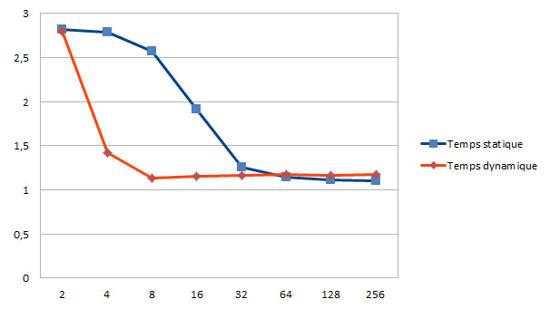
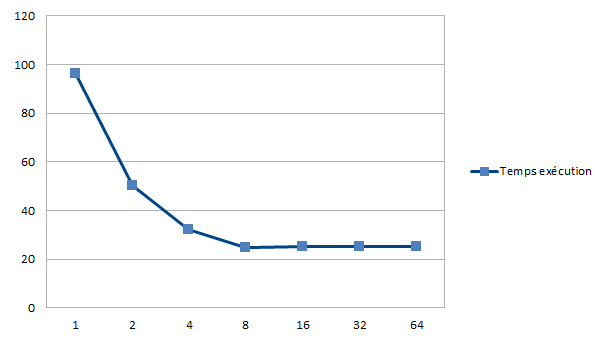

# TD/TP2 : OpenMP

## Question 1

```
cat /proc/cpuinfo  
cpu cores	: 4
```

## Question 2

```
export OMP_NUM_THREADS=4

gcc -fopenmp -o omp_hello omp_hello.c 
```

## Question 3

Voir [mandel_openMP.c](src/mandel_openMP.c)

```
gcc -fopenmp -o mandel_openMP mandel_openMP.c -lm

./mandel_openMP
```

Test effectué avec OpenMP sur Mandel avec les valeurs par défaut de mandel



Nous retrouvons les même conclusions que pour le TP1, la répation dynamique est plus efficace

Pour plus de détails voir l'annexe 3


## Question 4

Voir [convol_openMP.c](src/convol_openMP.c)

```
gcc -fopenmp -o convol_openMP convol_openMP.c -lm

./convol_openMP Sukhothai_4080x6132.ras 0 100
```

Test effectué avec OpenMPsur de la Convolutionde l'image Sukhothai_4080x6132 avec les valeurs ras 0 100



Avec la répartion laissez aux choix d'openMP on se rend compte que même avec l'augmention du nombre de processus, la vitesse d'exécution devient stable

Pour plus de détails voir l'annexe 3